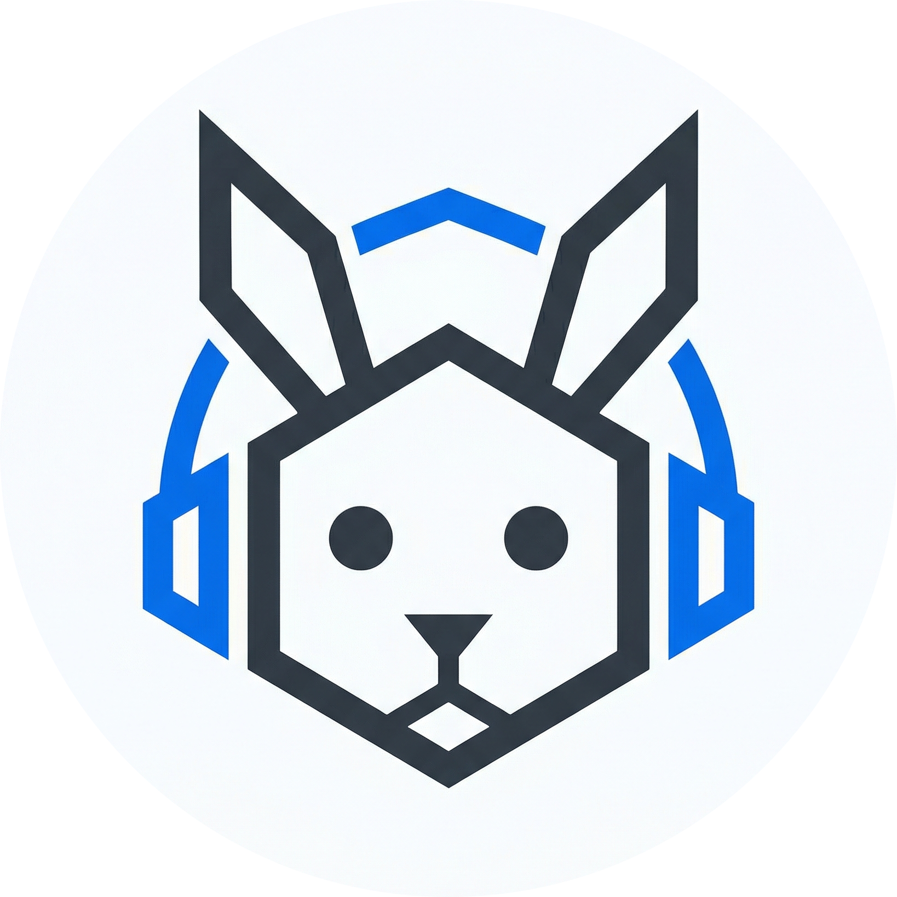
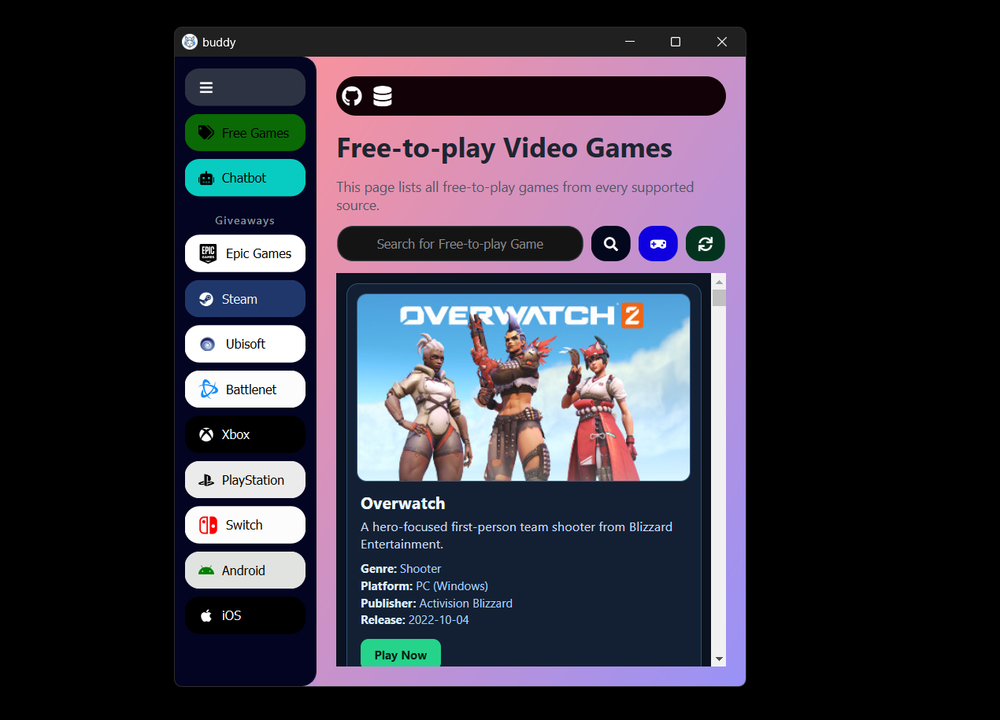
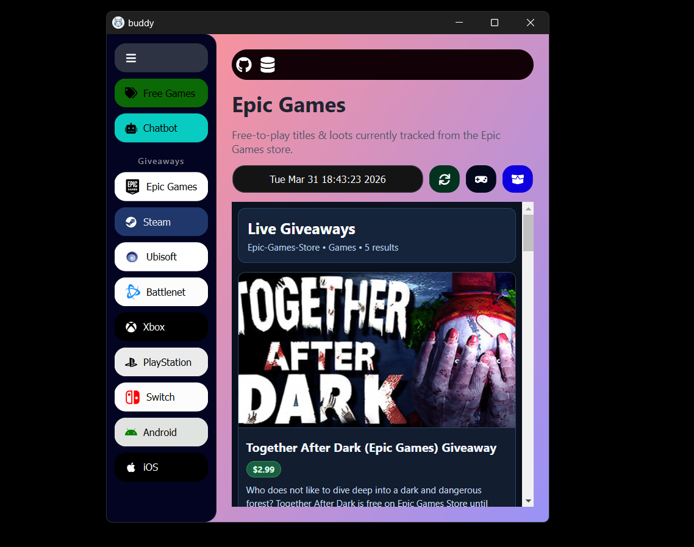
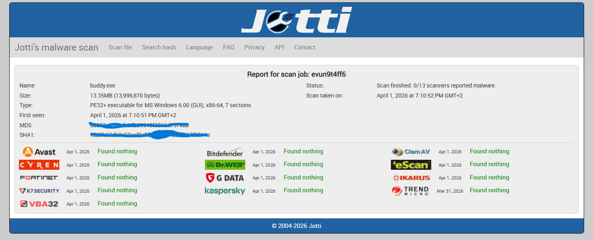

<p align="center">
  
</p>

<h1 align="center">Buddy</h1>

<p align="center">
  A desktop app for gamers to discover free-to-play games, platform giveaways, and use an AI gaming assistant.
</p>

## Quick Navigation
- [Quick Navigation](#quick-navigation)
- [About The Project](#about-the-project)
- [Current Platform Support](#current-platform-support)
- [Download For Windows (.exe)](#download-for-windows-exe)
- [Features](#features)
- [Screenshots](#screenshots)
  - [Free-to-Play Games](#free-to-play-games)
  - [Giveaways](#giveaways)
- [Windows EXE Virus Scan Report](#windows-exe-virus-scan-report)
- [Manual Installation (All OS)](#manual-installation-all-os)
  - [Prerequisites](#prerequisites)
  - [1. Clone The Repository](#1-clone-the-repository)
  - [2. Create \& Activate Virtual Environment](#2-create--activate-virtual-environment)
    - [Windows (PowerShell)](#windows-powershell)
    - [Linux](#linux)
    - [macOS](#macos)
  - [3. Install Dependencies](#3-install-dependencies)
  - [4. Rename `example.config.yaml` to `config.yaml`](#4-renmame-exampleconfigyaml-to-configyaml)
    - [Windows (PowerShell)](#windows-powershell-1)
    - [Linux/macOS](#linuxmacos)
  - [5. Run The App](#5-run-the-app)
- [AI Chatbot Setup (API Keys + Model Selection)](#ai-chatbot-setup-api-keys--model-selection)
  - [Supported Providers](#supported-providers)
  - [Example `config.yaml`](#example-configyaml)
  - [Important Notes](#important-notes)
- [Troubleshooting](#troubleshooting)
- [Tech Stack](#tech-stack)
- [License](#license)

## About The Project
Buddy is a gamer-focused desktop application built with Python and PyQt6. It helps you browse free games and giveaways from multiple gaming platforms in one place, and includes an AI chatbot screen for quick gaming-related help.

## Current Platform Support
- Windows: Officially available right now.
- Linux: No prebuilt release yet (manual Python setup supported).
- macOS: No prebuilt release yet (manual Python setup supported).

## Download For Windows (.exe)
Windows users can download the prebuilt `.exe` package from this repository's **GitHub Releases** section.

1. Open the repository on GitHub.
2. Go to [`Releases`](https://github.com/CoderRony955/buddy/releases).
3. Download the latest Windows `.exe` named `buddy_win.zip` build asset.
4. Extract it (if zipped) and run the executable.

## Features
- Unified view of free-to-play games.
- Giveaway sections for multiple platforms:
  - Epic Games
  - Steam
  - Ubisoft
  - Battle.net
  - Xbox
  - PlayStation
  - Nintendo Switch
  - Android
  - iOS
- Built-in AI chatbot assistant for gaming Q&A.
- Provider-based AI setup (OpenAI, Google GenAI, Anthropic, Ollama Cloud).
- Model customization using `./config.yaml`.

## Screenshots
### Free-to-Play Games


### Giveaways


## Windows EXE Virus Scan Report
The latest virus scan report for the Windows `buddy.exe` build:

- [virus_scanner_report.png](./report/virus_scanner_report.png)



## Manual Installation (All OS)
Prebuilt binaries are currently for Windows only. Linux and macOS users can run Buddy manually with Python + pip.

### Prerequisites
- Python `3.13+`
- `pip`
- Internet connection (for fetching giveaway/game data and cloud AI providers)

### 1. Clone The Repository
```bash
git clone https://github.com/CoderRony955/buddy.git
cd buddy
```

### 2. Create & Activate Virtual Environment

#### Windows (PowerShell)
```powershell
python -m venv .venv
.\.venv\Scripts\Activate.ps1
```

#### Linux
```bash
python3 -m venv .venv
source .venv/bin/activate
```

#### macOS
```bash
python3 -m venv .venv
source .venv/bin/activate
```

### 3. Install Dependencies
```bash
pip install -r requirements.txt
```

### 4. Renmame `example.config.yaml` to `config.yaml`
Buddy reads AI provider settings from `./config.yaml`.

Copy the template:

#### Windows (PowerShell)
```powershell
Copy-Item example.config.yaml config.yaml
```

#### Linux/macOS
```bash
cp example.config.yaml config.yaml
```

### 5. Run The App
```bash
python main.py
```

## AI Chatbot Setup (API Keys + Model Selection)
The AI chatbot requires provider API keys in `./config.yaml`.

### Supported Providers
- `openai`
- `google_genai`
- `anthropic`
- `ollama_cloud`

### Example `config.yaml`
```yaml
anthropic:
  api_key: "YOUR_ANTHROPIC_API_KEY"
  model: "claude-3-5-sonnet-latest"
google_genai:
  api_key: "YOUR_GOOGLE_API_KEY"
  model: "gemini-3-flash-preview"
ollama_cloud:
  api_key: "YOUR_OLLAMA_CLOUD_API_KEY"
  model: "gpt-oss:120b-cloud"
openai:
  api_key: "YOUR_OPENAI_API_KEY"
  model: "gpt-4.1-mini"
```

### Important Notes
- Add API key(s) for the provider(s) you want to use.
- You can change the model anytime by editing the `model` value under that provider.
- If you want a specific model, set that model name directly in `./config.yaml`.
- Keep `config.yaml` private and do not commit your real API keys.

## Troubleshooting
- `config.yaml file is not found`:
  - Create it by copying `example.config.yaml` to `config.yaml`.
- Import/module errors:
  - Make sure your virtual environment is activated.
  - Re-run `pip install -r requirements.txt`.
- AI responses not working:
  - Verify provider API key and model name in `config.yaml`.
  - Confirm your selected model is available for that provider account.

## Tech Stack
- Python 3.13+
- PyQt6 + PyQt6-WebEngine
- LangChain integrations:
  - OpenAI
  - Google GenAI
  - Anthropic
- Ollama
- YAML-based local configuration

## License
This project is released under the [`GPL-3.0`](https://github.com/CoderRony955/buddy/blob/main/LICENSE) LICENSE.
